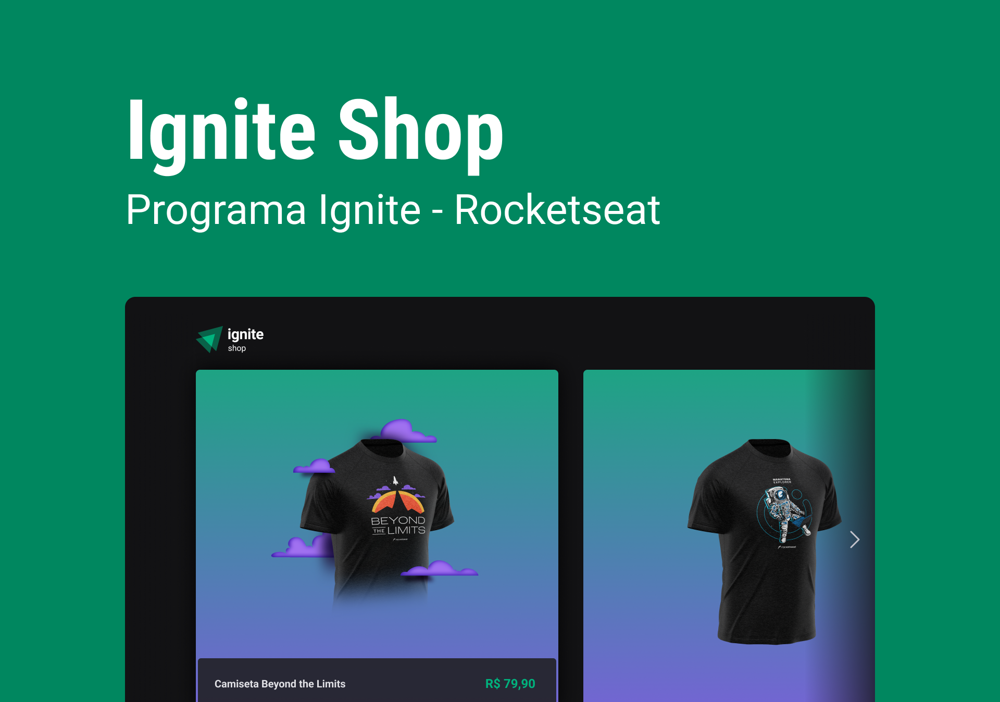

<br>

## Index 

[About](#about)

[Technologies](#technologies)

[Getting Started](#getting-started)

<br>

## About


It is a simple e-commerce made with [Next.js](https://nextjs.org/) project.

<br>

<p align="center">
  
</p>

## Technologies

Technologies and tools used for development this app:


- [Stitches](https://stitches.dev/)
- [Keen Slider](https://keen-slider.io/)
- [Stripe](https://stripe.com/)

<br>

## Getting Started

```bash
# Open a terminal and clone this repository with the command
git clone https://github.com/ldanielz/Ignite-Shop.git
# or download it.

cd ignite-shop

# Dependencies install
npm install

# Run app
npm run dev

```

Open [http://localhost:3000](http://localhost:3000) with your browser to see the result.

<br>

---

Made by [Lizandro Daniel](https://github.com/ldanielz)

[](https://www.linkedin.com/in/ldanielzenteno/) 
